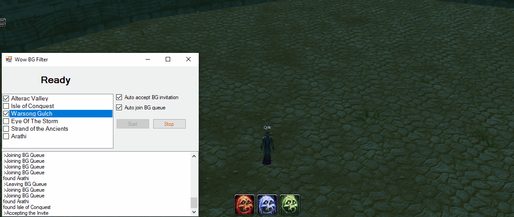

# WoW BG Filter

A specialized C# WinForms utility designed for real-time monitoring and automation of World of Warcraft (WoW) Battleground (BG) queues by intercepting game traffic and automating queue management.

## 🚀 Key Features
*   **Real-Time Packet Interception**: Uses Windows Sockets to peek into incoming game packets, identifying the specific battleground type before the invitation is even shown.
*   **Live Memory Integration**: Out of process memory reading, syncing intercepted data with real-time game client variables.
*   **Custom Filter System**: User-configurable filters to automatically "Ignore" unwanted battlegrounds (e.g., Isle of Conquest, Alterac Valley) based on personal preference.
*   **Workflow Automation**: 
    *   **Auto-Queue**: Automatically applies for Random Battleground invitations.
    *   **Auto-Accept/Leave**: Instantly accepts desired invitations or leaves the queue if the match doesn't meet filter criteria.

## ⚙️ How It Works
*   **Asynchronous Socket Handling**: Manages a non-blocking socket to monitor TCP/UDP payloads without interfering with game latency.
*   **Memory Offset Mapping**: Maps specific game client offsets to C# variables to track queue timers and character states in real-time.
*   **Automated State Machine**: Handles the transition between "Queued," "Invited," and "In-Progress" states automatically based on filtered criteria.

## 🏁 Getting Started
1. **Clone the Repository**: Use the GitHub Desktop client or run `git clone https://github.com/seg3214/WowBgFilter`.  
2. **Prerequisites**: Ensure you have the .NET Framework installed.  

> ## ⚠️ Legal Disclaimer
> 
> **This tool is for educational and research purposes only.** 
>
> ### 🛡️ Use at Your Own Risk
> The author (and any contributors) are NOT responsible for:
> *   **Account Actions:** Any bans, suspensions, or penalties applied to your accounts by game developers or anti-cheat systems (e.g., VAC, BattlEye, Easy Anti-Cheat).
> *   **System Damage:** Any data loss, hardware failure, or system instability caused by the use of this software.
> *   **Legal Consequences:** Any misuse of this tool that violates local laws or third-party Terms of Service.
> 
> ### 📜 License
> This project is licensed under the **GNU Affero General Public License v3.0 (AGPL-3.0)**. 
> THE SOFTWARE IS PROVIDED "AS IS", WITHOUT WARRANTY OF ANY KIND, EXPRESS OR IMPLIED. 